# ARCH-LLM-Integration — 架构设计

> Version: 1.0 | Date: 2026-06-27
> 对应 PRD: [`../prd/PRD-LLM-Integration.md`](../prd/PRD-LLM-Integration.md) v1.5
> 范围: 桌面宠物 CoreAIpet 的 **LLM 接入 + Chat 终端 + Tool/MCP/Memory 子系统**

---

## 0. 阅读指南

### 0.1 本文与 PRD 的关系

| | PRD-LLM-Integration.md | ARCH-LLM-Integration.md (本文) |
|---|---|---|
| 视角 | 产品 / 验收 | 架构 / 实现策略 |
| 回答 | **What** 要做 / **Why** 要做 | **How** 拼装 / **Why this pattern** / **How it fails** |
| 主要读者 | PM / 评审 / 测试 | 实现者 / 安全审计 / SRE |
| 变更频率 | 每次需求迭代都改 | 大版本切换才改 |
| 结构主轴 | 功能特性 (§4 功能、§5 UI、§6 后端) | 质量属性 (模式 / 可用性 / 安全 / 美学 / 扩展) |

**本文不重复 PRD**。当本文引用一个具体决定时，写成 `PRD §x.y`，读者按需跳转。本文专注于：

1. 把 PRD 的离散设计决策抽象成 **模式语言**。
2. 给 Harness 工程加上 **可用性 + 安全** 的具体工程约束。
3. 为 UI 定义可复用的 **设计系统**（PRD 给的是布局，本文给的是体系）。
4. 把 Provider / Tool / Preview 三类扩展点压成一个统一的 **扩展模型**。

### 0.2 五大质量属性如何分布

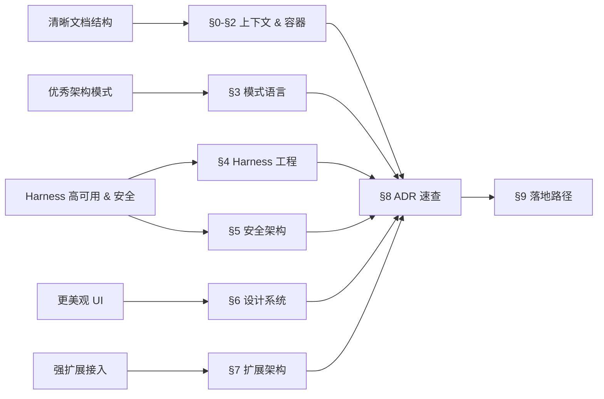
```mermaid
graph LR
  QA1[清晰文档结构] --> S0[§0-§2 上下文 & 容器]
  QA2[优秀架构模式] --> S3[§3 模式语言]
  QA3[Harness 高可用 & 安全] --> S4[§4 Harness 工程]
  QA3 --> S5[§5 安全架构]
  QA4[更美观 UI] --> S6[§6 设计系统]
  QA5[强扩展接入] --> S7[§7 扩展架构]
  S0 & S3 & S4 & S5 & S6 & S7 --> S8[§8 ADR 速查]
  S8 --> S9[§9 落地路径]
```

### 0.3 符号与图例

- 实线箭头 = 同步调用
- 虚线箭头 = 异步事件 / 流式
- 双线边框 = 信任边界（跨域必校验）
- **粗体 PRD §x.y** = PRD 中的硬决定，本文不复议

---

## 1. 上下文与边界 (C4 L1)

### 1.1 System Context

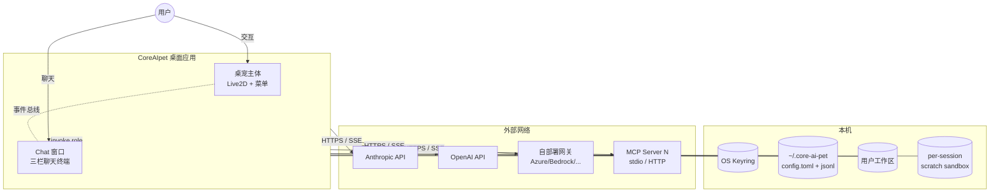
```mermaid
graph TB
  User((用户))
  subgraph App[CoreAIpet 桌面应用]
    Pet[桌宠主体<br/>Live2D + 菜单]
    ChatWin[Chat 窗口<br/>三栏聊天终端]
    Pet -.事件总线.- ChatWin
  end
  subgraph Local[本机]
    OSCred[(OS Keyring)]
    FSConfig[(~/.core-ai-pet<br/>config.toml + jsonl)]
    FSWS[(用户工作区)]
    FSScratch[(per-session<br/>scratch sandbox)]
  end
  subgraph Net[外部网络]
    Anthropic[Anthropic API]
    OpenAI[OpenAI API]
    GW[自部署网关<br/>Azure/Bedrock/...]
    MCP1[MCP Server N<br/>stdio / HTTP]
  end
  User -->|交互| Pet
  User -->|聊天| ChatWin
  ChatWin -->|invoke role| App
  App -->|HTTPS / SSE| Anthropic
  App -->|HTTPS / SSE| OpenAI
  App -->|HTTPS / SSE| GW
  App -->|stdio / HTTP| MCP1
  App --- OSCred
  App --- FSConfig
  App --- FSWS
  App --- FSScratch
```

### 1.2 信任域 (Trust Zones)

| 信任域 | 包含 | 信任级别 | 出域规则 |
|---|---|---|---|
| **Z0 桌面进程内** | Vue 渲染层 + Rust 核心 | 高（用户授权） | 任何出 Z0 的调用必须经 Facade 闸门 |
| **Z1 本机文件系统** | TOML / jsonl / scratch | 中（路径受限） | 严格白名单（workspace_root + scratch_dir）|
| **Z2 OS Keyring** | API key 密文 | 高 | 只通过 `secret_ref` 间接引用，明文不出 Z2 |
| **Z3 MCP / 子进程** | MCP server | 低（用户配置） | 工具调用强制 confirm + capability whitelist |
| **Z4 外网 Provider** | Anthropic/OpenAI/GW | 不可信外部 | Egress 闸门（PRD §4.17）+ PII 脱敏（§4.18）+ 配额（§4.19）|

**核心原则**：Z0 → Z4 的数据流必须经过 **三层闸门**：Egress 策略 → PII 脱敏 → 配额扣减。任何一层拒绝 = 拒绝出域。详见 §5.2。

### 1.3 与桌宠主程序的关系

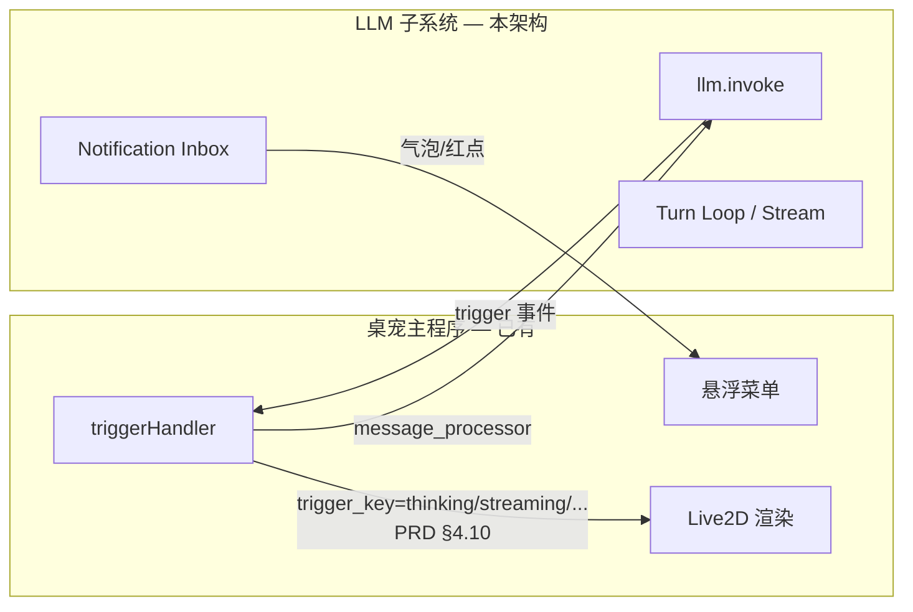
```mermaid
graph LR
  subgraph Pet[桌宠主程序 — 已有]
    Trigger[triggerHandler]
    Live2D[Live2D 渲染]
    Menu[悬浮菜单]
  end
  subgraph LLM[LLM 子系统 — 本架构]
    Client[llm.invoke]
    Harness[Turn Loop / Stream]
    Inbox[Notification Inbox]
  end
  Trigger -->|trigger_key=thinking/streaming/...<br/>PRD §4.10| Live2D
  Trigger -->|message_processor| Client
  Client -->|trigger 事件| Trigger
  Inbox -->|气泡/红点| Menu
```

LLM 子系统 **只通过事件 + 公共门面** 与桌宠主程序交互。桌宠主程序不直接 import LLM 内部模块。

---

## 2. 容器与运行时 (C4 L2)

### 2.1 容器图

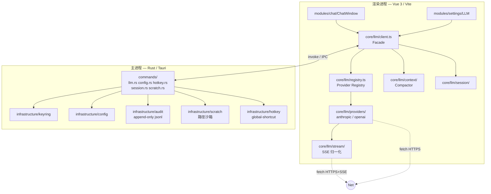
```mermaid
graph TB
  subgraph Renderer[渲染进程 — Vue 3 / Vite]
    direction TB
    UI[modules/chat/ChatWindow]
    Setting[modules/settings/LLM]
    Core[core/llm/client.ts<br/>Facade]
    Stream[core/llm/stream/<br/>SSE 归一化]
    Reg[core/llm/registry.ts<br/>Provider Registry]
    Prov[core/llm/providers/<br/>anthropic / openai]
    Ctx[core/llm/context/<br/>Compactor]
    Sess[core/llm/session/]
    UI --> Core
    Setting --> Core
    Core --> Reg
    Core --> Ctx
    Core --> Sess
    Reg --> Prov
    Prov --> Stream
  end
  subgraph Main[主进程 — Rust / Tauri]
    direction TB
    Cmd[commands/<br/>llm.rs config.rs hotkey.rs<br/>session.rs scratch.rs]
    Sec[infrastructure/keyring]
    TOML[infrastructure/config]
    Audit[infrastructure/audit<br/>append-only jsonl]
    FS[infrastructure/scratch<br/>路径沙箱]
    Hot[infrastructure/hotkey<br/>global-shortcut]
    Cmd --> Sec
    Cmd --> TOML
    Cmd --> Audit
    Cmd --> FS
    Cmd --> Hot
  end
  Core <-->|invoke / IPC| Cmd
  Stream -.->|fetch HTTPS+SSE| Net((Net))
  Prov -.->|fetch HTTPS| Net
```

### 2.2 进程拓扑

| 进程 | 数量 | 职责 | 失败恢复 |
|---|---|---|---|
| Renderer (WebView) | 1 主 + N Chat 窗口 | UI、Facade、Provider 调用 | crash → Tauri 重建 |
| Main (Rust) | 1 | TOML / Keyring / 审计 / 热键 / IPC | crash → 应用退出（无 in-process 兜底）|
| MCP child | 0..N | 用户配置的 MCP server | crash → 标记 unavailable，下次工具调用前重启 |

**关键决策（ADR-006）**：Provider HTTPS 调用放在 **Renderer 进程**（fetch + Web Streams 原生支持 SSE），不绕到 Rust。Rust 只做必须本机能力（Keyring/Audit/FS/Hotkey）。理由：

1. SSE 的逐 token 推送在 Renderer 直收延迟最低，不必经一次 IPC。
2. Rust 端写 HTTP+SSE 客户端是重复造轮子。
3. **但**：API key 永不进 Renderer 内存。Renderer 拿到的是 `secret_ref`，调 `invoke('llm_inject_auth', { secret_ref, request })` 由 Rust 写 Authorization header 后 **回填一个 short-lived signed URL / 临时凭证**，或者由 Rust 起一个本机回环代理（loopback proxy）。

详见 §5.3 凭证生命周期。

### 2.3 通信通道矩阵

| 源 | 目 | 通道 | 同步性 | 备注 |
|---|---|---|---|---|
| Renderer UI | Renderer Facade | 函数调用 | 同步 | 同进程 |
| Renderer Facade | Provider | `fetch` + ReadableStream | 异步流 | 直连外网 |
| Renderer Facade | Rust commands | `@tauri-apps/api/core invoke` | 异步 | IPC, JSON 序列化 |
| Rust | Keyring | crate (`keyring`) | 同步 | 失败回落 DPAPI |
| Rust | MCP child | stdin/stdout JSON-RPC | 异步 | line-delimited |
| Rust | Renderer | `emit_to(window, event, payload)` | 异步 | 单向通知 |

---

## 3. 模式语言 — 优秀的架构模式

本节把 PRD 的设计决策映射到经典模式，给每个模式标注 **动机 / 位置 / 失败模式**。

### 3.1 分层架构 (Layered) — 主骨架

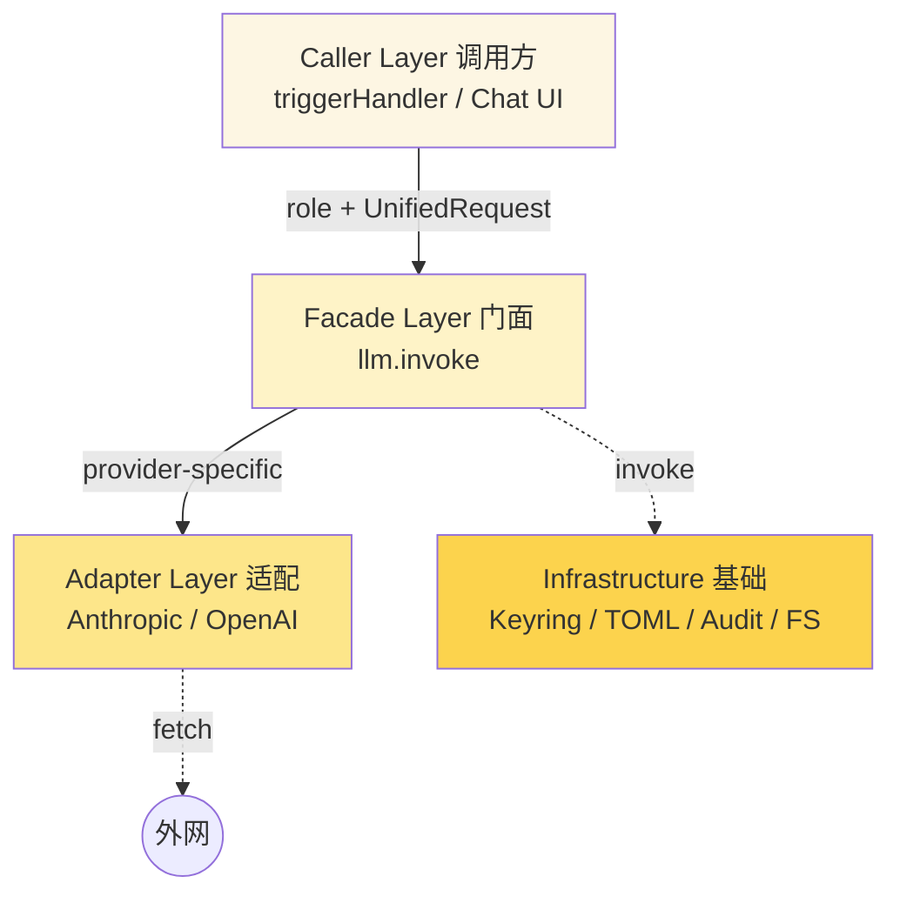
```mermaid
graph TB
  L1[Caller Layer 调用方<br/>triggerHandler / Chat UI]
  L2[Facade Layer 门面<br/>llm.invoke]
  L3[Adapter Layer 适配<br/>Anthropic / OpenAI]
  L4[Infrastructure 基础<br/>Keyring / TOML / Audit / FS]
  L1 -->|role + UnifiedRequest| L2
  L2 -->|provider-specific| L3
  L3 -.->|fetch| Net((外网))
  L2 -.->|invoke| L4
  style L1 fill:#fdf6e3
  style L2 fill:#fef3c7
  style L3 fill:#fde68a
  style L4 fill:#fcd34d
```

| 层 | 知道什么 | 不知道什么 |
|---|---|---|
| Caller | role 名称 | 哪家 Provider |
| Facade | 角色 ↔ 配置映射 | Provider 私有协议 |
| Adapter | 具体厂商协议 | 角色概念 |
| Infrastructure | 持久化与本机能力 | 上层业务 |

**依赖方向铁律**：上 → 下，绝不回路。Adapter 永远不 import Facade，Facade 永远不 import Caller。CI 用 ESLint `no-restricted-imports` 强校验。

**对应 PRD**: §4.1。

### 3.2 六边形 / Ports & Adapters — 替换性

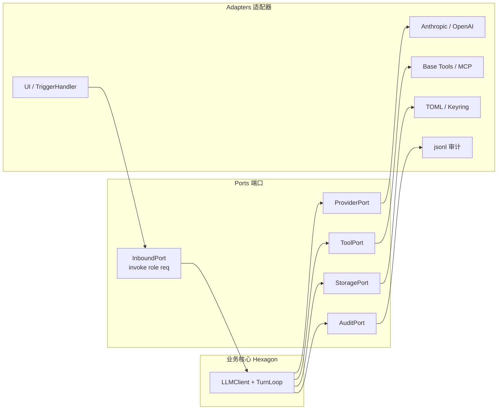
```mermaid
graph LR
  subgraph Hex[业务核心 Hexagon]
    Core[LLMClient + TurnLoop]
  end
  subgraph Ports[Ports 端口]
    PIn[InboundPort<br/>invoke role req]
    POut1[ProviderPort]
    POut2[ToolPort]
    POut3[StoragePort]
    POut4[AuditPort]
  end
  subgraph Adapters[Adapters 适配器]
    AIn[UI / TriggerHandler]
    AOut1[Anthropic / OpenAI]
    AOut2[Base Tools / MCP]
    AOut3[TOML / Keyring]
    AOut4[jsonl 审计]
  end
  AIn --> PIn --> Core
  Core --> POut1 --> AOut1
  Core --> POut2 --> AOut2
  Core --> POut3 --> AOut3
  Core --> POut4 --> AOut4
```

**动机**：在测试里把 `AOut1` 换成 `MockProvider`，把 `AOut2` 换成 `InMemoryTool`，业务核心一行不改。**这是 §9 测试计划能跑得起来的前提**。

**反模式**：业务核心里写 `if (provider === 'anthropic') ...` —— 禁止，PR 直接打回。

### 3.3 Registry — 统一扩展点

CoreAIpet 一共有 **三个** Registry，行为同构但用途不同：

| Registry | 注册的是 | PRD 锚点 | 排序键 |
|---|---|---|---|
| `LLMRegistry` | role → 运行时 Provider 实例 | §4.2 | role 唯一 |
| `ProviderPluginRegistry` | Provider 厂商插件 | §4.15 | id 唯一 |
| `PreviewProviderRegistry` | 文件预览器 | §5.13.1 | priority (desc) + id |

**统一形状**：

```ts
interface Registry<T extends { id: string }> {
  register(item: T): void;
  unregister(id: string): void;
  resolve(...args: any[]): T | null;  // 各 registry 自定义匹配
  list(): readonly T[];
}
```

**通用约束（所有 Registry 必须遵守）**：

1. **register 幂等**：同 id 二次注册 → 后者覆盖前者并打 `WARN`。
2. **register 有上限**：默认 32（防 plugin 风暴）。超出 → 抛错。
3. **resolve 纯函数**：不做 IO。重型校验留给 `canRender` / `init`。
4. **list 返回 readonly**：消费者不能就地修改。

### 3.4 Strategy — Context 压缩三策略

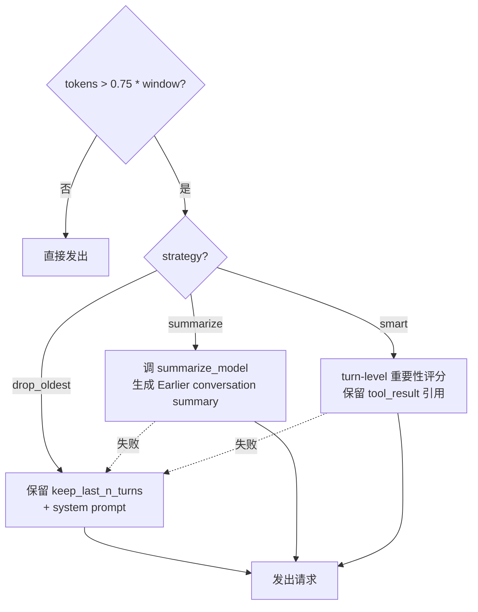
```mermaid
graph TB
  Trigger{tokens > 0.75 * window?}
  Trigger -->|否| Pass[直接发出]
  Trigger -->|是| Strategy{strategy?}
  Strategy -->|drop_oldest| S1[保留 keep_last_n_turns<br/>+ system prompt]
  Strategy -->|summarize| S2[调 summarize_model<br/>生成 Earlier conversation summary]
  Strategy -->|smart| S3[turn-level 重要性评分<br/>保留 tool_result 引用]
  S1 & S2 & S3 --> Out[发出请求]
  S2 -.失败.-> S1
  S3 -.失败.-> S1
```

**对应 PRD**: §4.21。

**关键失败设计**：summarize / smart 失败 → 回落到 drop_oldest，**绝不**直接报错给用户。`llm.compacting` trigger 让桌宠做"打字思考"动作，UI 上显示"正在整理上下文..."。

### 3.5 Saga / Orchestration — Turn Loop

Turn = 一轮对话（PRD §4.6）。Turn 内部是多次 Provider 往返 + 工具调用，本质上是 **长事务**。用 Saga 模式管理：

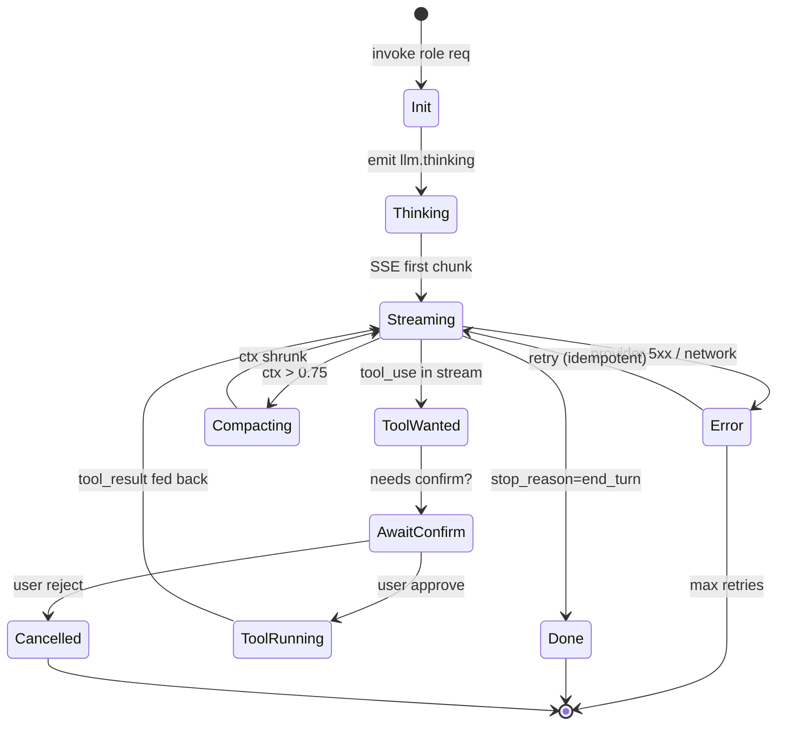
```mermaid
stateDiagram-v2
  [*] --> Init: invoke role req
  Init --> Thinking: emit llm.thinking
  Thinking --> Streaming: SSE first chunk
  Streaming --> ToolWanted: tool_use in stream
  Streaming --> Done: stop_reason=end_turn
  ToolWanted --> AwaitConfirm: needs confirm?
  AwaitConfirm --> ToolRunning: user approve
  AwaitConfirm --> Cancelled: user reject
  ToolRunning --> Streaming: tool_result fed back
  Streaming --> Compacting: ctx > 0.75
  Compacting --> Streaming: ctx shrunk
  Streaming --> Error: provider 5xx / network
  Error --> Streaming: retry (idempotent)
  Error --> [*]: max retries
  Done --> [*]
  Cancelled --> [*]
```

**每个状态都映射一个 `trigger_key`**（PRD §4.10），桌宠表情/动作随之切换。

**Saga 补偿动作**：
- ToolRunning 失败 → 工具结果记 `{ok: false, error}`，喂回 LLM 让它决定下一步。**不**直接抛给用户。
- Compacting 失败 → 见 §3.4，回落策略。
- Error 重试 → 用 Idempotency-Key，详见 §4.4。

### 3.6 Event Sourcing (Lite) — 审计日志

`~/.core-ai-pet/audit/audit-YYYY-MM.jsonl` 是 **append-only** 事件流（PRD §6.6）。

```
{ts, session_id, turn_id, event_type, payload_hash, prev_hash, ...meta}
```

- **不存** prompt/response 全文（含 PII）。只存 hash + 形状信息（msg count, token count, model, latency, cost）。
- **hash chain**：`prev_hash` 链式串联，篡改任何一条 → 后续所有 hash 失配。
- **可重放**：crash 后重启可从 audit 还原"未完结 turn"列表（不还原内容，只还原计数 / 配额状态）。

**为什么不是 full Event Sourcing**：业务核心仍是命令式（性能 + 简单）；审计只是 **副本流**。

### 3.7 Bulkhead — 每 Provider 独立资源池

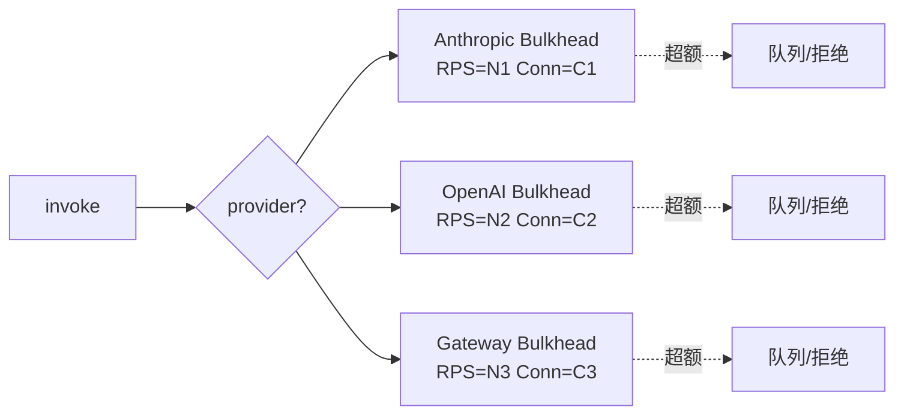
```mermaid
graph LR
  Inv[invoke] --> Disp{provider?}
  Disp --> A[Anthropic Bulkhead<br/>RPS=N1 Conn=C1]
  Disp --> O[OpenAI Bulkhead<br/>RPS=N2 Conn=C2]
  Disp --> G[Gateway Bulkhead<br/>RPS=N3 Conn=C3]
  A -.超额.-> Q1[队列/拒绝]
  O -.超额.-> Q2[队列/拒绝]
  G -.超额.-> Q3[队列/拒绝]
```

**动机**：Anthropic 429 风暴不能拖垮 OpenAI 调用（chat_assistant 用 Anthropic、message_processor 可能用 OpenAI）。每个 Provider 独立 Token Bucket，互不挤兑。

详见 §4.5。

### 3.8 CQRS-Lite — 配置读写分离

| 路径 | 读 | 写 |
|---|---|---|
| `config.toml` (LLM/MCP) | 启动时 load → 内存常驻；watch 文件可热更 | 设置页保存 → 原子写 → reload |
| `hotkeys.toml` | 同上 | 设置页保存 → reload + 重注册 global shortcut |
| `state.toml` (last workspace) | 启动时 load | 每次 session 创建 → 写入 |
| Session jsonl | 按需 mmap | append 每条 message |

**不入 SQLite 的理由**（ADR-003）：配置是低频读写、人可读编辑、版本控制友好。SQLite 是过度工程。

---

## 4. Harness 工程 — 高可用 + 安全

### 4.1 Harness 是什么

**Harness ≠ Provider SDK**。

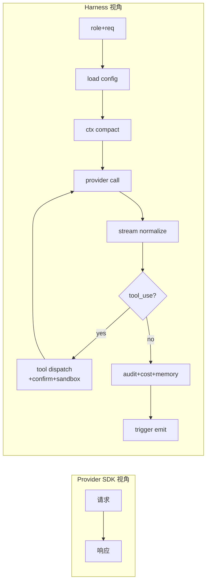
```mermaid
graph LR
  subgraph SDK[Provider SDK 视角]
    S1[请求] --> S2[响应]
  end
  subgraph Harness[Harness 视角]
    H1[role+req] --> H2[load config]
    H2 --> H3[ctx compact]
    H3 --> H4[provider call]
    H4 --> H5[stream normalize]
    H5 --> H6{tool_use?}
    H6 -->|yes| H7[tool dispatch<br/>+confirm+sandbox]
    H7 --> H4
    H6 -->|no| H8[audit+cost+memory]
    H8 --> H9[trigger emit]
  end
```

**Harness 的边界（PRD §4.1 Facade + 本节扩展）**：

- **入口唯一**：`llm.invoke(role, req, opts)`。业务代码不直接 import providers/。
- **状态有界**：Harness 不全局持有 session（session 是 caller 的数据，Harness 只在一次 invoke 内持有 turn 状态）。
- **副作用可枚举**：HTTP 出域、audit 写、cost 扣减、trigger emit、scratch 写。每一个都过对应 Port。

### 4.2 Turn Loop 状态机

详细状态见 §3.5 stateDiagram。这里给 **超时表**：

| 状态 | 超时 | 超时动作 | 配置项 |
|---|---|---|---|
| Init | 1s | 视为 provider 不可用 | `timeouts.init_ms` |
| Thinking (no chunk yet) | 30s | 视为流不工作，主动 abort | `timeouts.first_chunk_ms` |
| Streaming (between chunks) | 60s | abort + retry once | `timeouts.inter_chunk_ms` |
| AwaitConfirm | 用户 5min 未响应 | 自动 reject，记 `audit.reason=user_idle` | `timeouts.confirm_ms` |
| ToolRunning | 单工具默认 30s（可在 Tool 定义里覆盖） | 工具结果记 `{ok:false, error:timeout}` 喂回 | `timeouts.tool_default_ms` |
| Compacting | 20s | 回落 drop_oldest | `timeouts.compact_ms` |

**全部超时 ≠ 报错**。超时是状态机的一个分支，进入相应的 fallback。

### 4.3 流式归一化管道

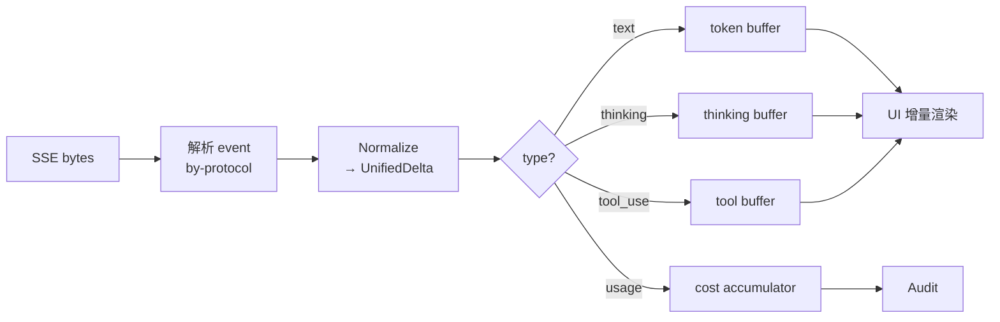
```mermaid
graph LR
  SSE[SSE bytes] --> Parse[解析 event<br/>by-protocol]
  Parse --> Norm[Normalize<br/>→ UnifiedDelta]
  Norm --> Demux{type?}
  Demux -->|text| Buf[token buffer]
  Demux -->|thinking| TB[thinking buffer]
  Demux -->|tool_use| TU[tool buffer]
  Demux -->|usage| Cost[cost accumulator]
  Buf & TB & TU --> Emit[UI 增量渲染]
  Cost --> Audit
```

`UnifiedDelta`：

```ts
type UnifiedDelta =
  | { type: 'text'; delta: string }
  | { type: 'thinking'; delta: string }
  | { type: 'tool_use_start'; id: string; name: string }
  | { type: 'tool_use_delta'; id: string; argsDelta: string }
  | { type: 'tool_use_end'; id: string }
  | { type: 'usage'; input_tokens?: number; output_tokens?: number; cached?: number }
  | { type: 'stop'; reason: 'end_turn' | 'tool_use' | 'max_tokens' | 'stop_sequence' }
  | { type: 'error'; recoverable: boolean; code: string; message: string };
```

**Anthropic Mapping**：`message_start` → 触发 Init；`content_block_delta type=thinking_delta` → thinking；`content_block_delta type=input_json_delta` → tool_use_delta；`message_delta.usage` → usage。

**OpenAI Mapping**：`choices[0].delta.content` → text；OpenAI 不原生支持 thinking → 跳过；`choices[0].delta.tool_calls` → tool_use_*；`usage` 在末尾 → 一次性 emit。

**Backpressure**：消费端用 `requestIdleCallback` 批量 flush，避免 60fps Live2D 卡顿。

### 4.4 可靠性：超时 / 重试 / 断路器 / Idempotency

#### 4.4.1 重试策略矩阵

| 错误类型 | 可重试? | 退避 | 上限 | Idempotency-Key |
|---|---|---|---|---|
| 网络超时 (init / first_chunk) | ✅ | 指数 250→1000→4000ms | 3 | 是 |
| 5xx | ✅ | 同上 + jitter | 3 | 是 |
| 429 (rate limit) | ✅ | 读 `retry-after` header | 2 | 是 |
| 400 / 422 (请求错) | ❌ | — | — | — |
| 401 / 403 (鉴权错) | ❌ | — | — | 提示用户检查 key |
| 网络中断 in-stream | 部分（仅 idempotent 起点）| 一次性重发 | 1 | 是 |
| Tool 执行超时 | ❌（喂回错误让 LLM 自己决定）| — | — | — |

**Idempotency-Key**：`sha256(role + req canonical_json + nonce_per_invoke)`，作为请求头。Provider 支持就用（Anthropic 用 `request-id`）；不支持也得算，用于 audit dedup。

#### 4.4.2 断路器 (Circuit Breaker)

每 Provider 独立断路器：

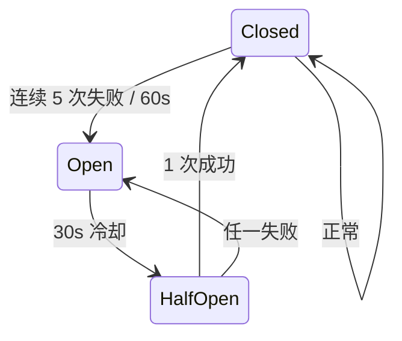
```mermaid
stateDiagram-v2
  Closed --> Open: 连续 5 次失败 / 60s
  Open --> HalfOpen: 30s 冷却
  HalfOpen --> Closed: 1 次成功
  HalfOpen --> Open: 任一失败
  Closed --> Closed: 正常
```

- **Open 状态下** invoke → 立即 `{type:'error', recoverable:false, code:'circuit_open'}`，不打外网。
- **触发动作**：UI toast + Pet 短促 sad 动作；audit 记 `circuit_open`。
- **关键边界**：断路器只看 5xx / 网络错；429 单独看，不计入断路器（短期速率问题，不是 Provider 挂了）。

#### 4.4.3 Bulkhead

参 §3.7。具体值：

```toml
[provider_pool.anthropic]
max_concurrent = 4         # 最多 4 个并发 invoke
queue_size = 16            # 超出排队
queue_timeout_ms = 5000    # 排队超时即拒绝
[provider_pool.openai]
max_concurrent = 4
queue_size = 16
queue_timeout_ms = 5000
```

满 → 排队 → 排队超时 → `{code:'pool_full'}`，UI 提示"模型繁忙，稍后再试"。

### 4.5 限流与配额

两套机制叠加：

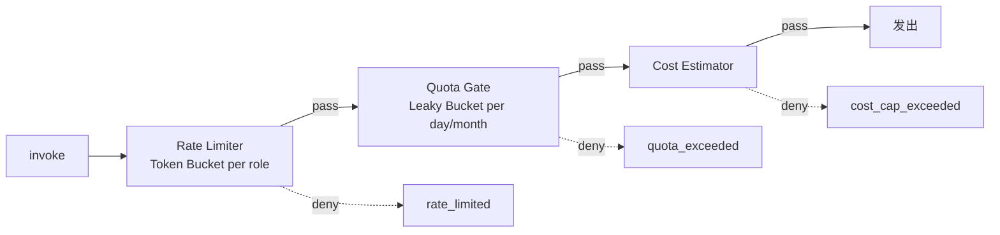
```mermaid
graph LR
  Inv[invoke] --> RL[Rate Limiter<br/>Token Bucket per role]
  RL -->|pass| Q[Quota Gate<br/>Leaky Bucket per day/month]
  Q -->|pass| Cost[Cost Estimator]
  Cost -->|pass| Out[发出]
  RL -.deny.-> Err1[rate_limited]
  Q -.deny.-> Err2[quota_exceeded]
  Cost -.deny.-> Err3[cost_cap_exceeded]
```

| 机制 | 用途 | 配置 PRD 锚点 |
|---|---|---|
| Rate Limit | 防止短时间高频调用（短抖动）| §4.19 `rate_limit` |
| Daily/Monthly Quota | 长期成本控制 | §4.19 `quotas` |
| Per-invoke Cost Cap | 单次最大允许花费（结合估算）| §4.19 `cost_cap_per_invoke` |

**预扣 + 结算**：发出请求前按 max_tokens 上限 **预扣**配额；响应回来后用真实 usage **结算**多退少补。crash 中断 → 启动时扫 audit 找未结算项，按 max_tokens 计入（保守）。

### 4.6 优雅降级矩阵

| 故障 | 降级行为 | 用户感知 |
|---|---|---|
| Provider A 断路器 Open | 提示用户切换 role 配置；不自动 fallback 到 B（避免数据未授权出域）| toast + 设置页角标 |
| MCP server 启动失败 | 该 MCP 工具置灰；其他工具不受影响 | 工具菜单 disabled tooltip |
| Keyring 不可用 (Linux 无桌面会话) | 回落到 DPAPI / 文件加密；提示用户 | 启动 toast |
| Scratch 目录满 (100MB 上限) | 拒新文件 + 提示清理 | inline 提示 |
| Compaction summarize_model 失败 | 回落 drop_oldest | 静默（log only）|
| Network offline | 所有 invoke 失败但 UI 不崩；提示离线 | "网络不可用" |
| Audit log 写失败（磁盘满）| invoke 拒绝（fail-closed 见 §5.8）| toast + 设置页警告 |

### 4.7 可观测性 — Logs / Metrics / Traces

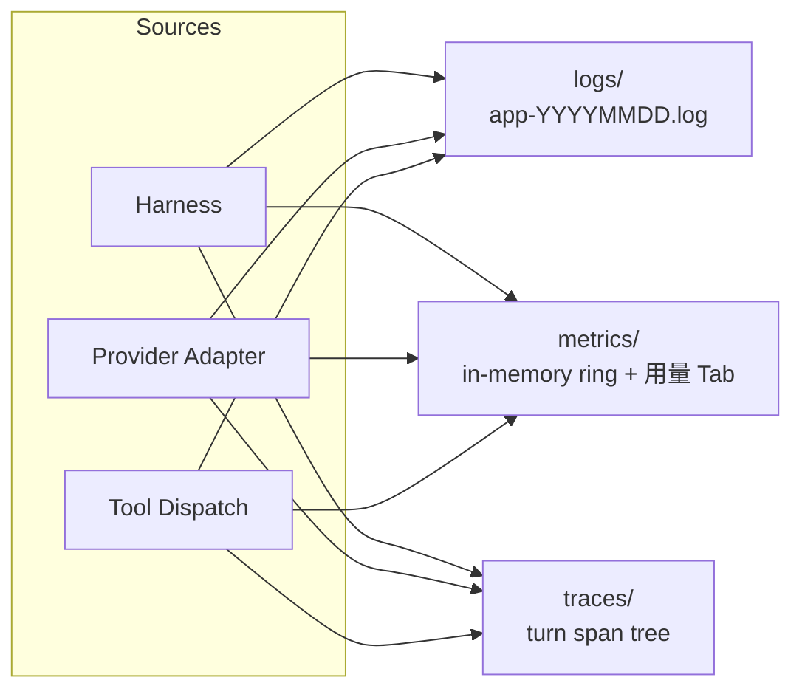
```mermaid
graph LR
  subgraph Sources
    A[Harness]
    B[Provider Adapter]
    C[Tool Dispatch]
  end
  A & B & C --> Log[logs/<br/>app-YYYYMMDD.log]
  A & B & C --> Metric[metrics/<br/>in-memory ring + 用量 Tab]
  A & B & C --> Trace[traces/<br/>turn span tree]
```

**Logs（PRD §6.4）**：分级、文件 + stderr，敏感字段（key/prompt/PII）一律 redacted。

**Metrics**（合并到 PRD §5.12 用量仪表盘）：

- counter: invoke_total{role, provider, outcome}
- histogram: turn_latency_ms{role, provider}
- gauge: provider_pool_in_flight{provider}
- counter: tokens_input/output{role, provider, model}
- counter: cost_usd{role, provider, model}

**Traces**：每个 invoke 一个 `turn_id`，所有日志/审计/metric 都打 turn_id。开发模式下导出为 trace JSON（兼容 Chrome devtools tracing）。

**SLO（PRD §6.7 占位，本节给目标值）**：

| 指标 | 目标 |
|---|---|
| invoke 启动 → first chunk P95 | < 3s（chat_assistant）|
| invoke 启动 → first chunk P95 | < 8s（message_processor 后台）|
| Crash-free sessions | > 99.5% / 周 |
| Audit 写入失败率 | < 0.01% |
| 配额估算误差（预扣 vs 实际）| < 5% |

### 4.8 故障注入测试

| 注入 | 期望结果 |
|---|---|
| Provider 模拟 500 三连 | 退避重试 3 次 → 上抛 error，UI 不卡死 |
| Provider 模拟 SSE 中途断开 | inter_chunk_ms 超时 → 重试一次 → 失败上抛 |
| 模拟 429 + retry-after=2 | 等 2s 后重试，成功 |
| 模拟 5xx × 5（断路器触发）| 第 6 次直接 circuit_open，不打外网 |
| 杀掉 MCP child | 下次工具调用前重启；用户无感（一次 retry）|
| 删除 keyring 项 | invoke 失败提示"未配置 API key" |
| scratch 目录写满 | 拒写 + UI 提示；其他功能不受影响 |
| 时钟跳变 ±1h | 退避/超时不混乱（用 monotonic clock）|

---

## 5. 安全架构

### 5.1 信任域划分

参 §1.2 表格。

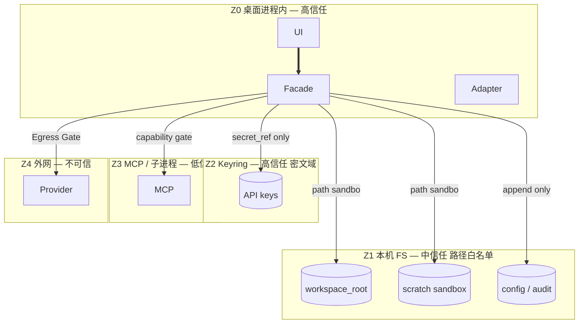
```mermaid
graph TB
  subgraph Z0[Z0 桌面进程内 — 高信任]
    UI
    Facade
    Adapter
  end
  subgraph Z1[Z1 本机 FS — 中信任 路径白名单]
    WS[(workspace_root)]
    Scratch[(scratch sandbox)]
    Conf[(config / audit)]
  end
  subgraph Z2[Z2 Keyring — 高信任 密文域]
    K[(API keys)]
  end
  subgraph Z3[Z3 MCP / 子进程 — 低信任]
    MCP
  end
  subgraph Z4[Z4 外网 — 不可信]
    Provider
  end
  UI ==> Facade
  Facade --Egress Gate--> Provider
  Facade --capability gate--> MCP
  Facade --path sandbox--> WS
  Facade --path sandbox--> Scratch
  Facade --secret_ref only--> K
  Facade --append only--> Conf
```

**双线 = 信任边界，跨域必校验**。

### 5.2 Egress 闸门 — 三层

参 §1.2。每次 invoke 出 Z0 → Z4 的请求必须依次过：

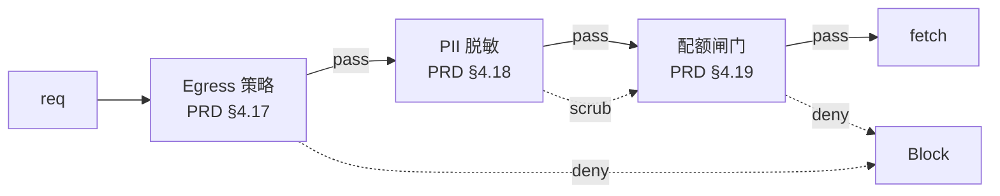
```mermaid
graph LR
  Req[req] --> E1[Egress 策略<br/>PRD §4.17]
  E1 -->|pass| E2[PII 脱敏<br/>PRD §4.18]
  E2 -->|pass| E3[配额闸门<br/>PRD §4.19]
  E3 -->|pass| Out[fetch]
  E1 -.deny.-> Block
  E2 -.scrub.-> E3
  E3 -.deny.-> Block
```

**Egress 策略**（PRD §4.17）确定 data class（free_text / file_content / workspace_files / pet_state / secrets / pii）能否发到此 provider。`secrets` 永不出域；`workspace_files` 仅当 provider 标记 allow_workspace 才出域。

**PII 脱敏**（PRD §4.18）规则可配置，命中 → 替换或 block；replace 模式下原文不再出现在出域 payload 中。

**配额闸门**（PRD §4.19 + §4.5）—— 见前节。

### 5.3 凭证生命周期

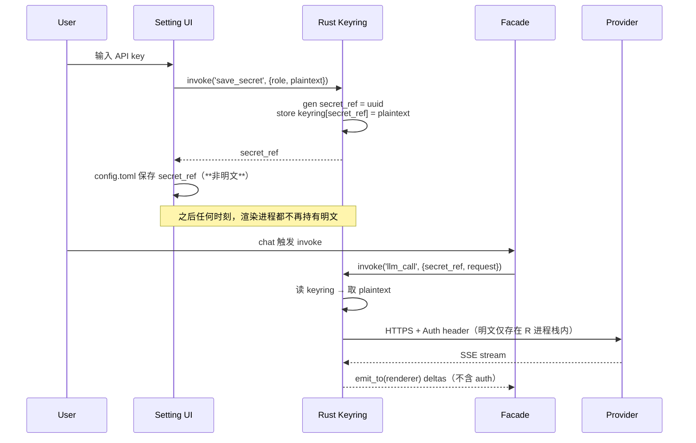
```mermaid
sequenceDiagram
  participant U as User
  participant UI as Setting UI
  participant R as Rust Keyring
  participant F as Facade
  participant P as Provider

  U->>UI: 输入 API key
  UI->>R: invoke('save_secret', {role, plaintext})
  R->>R: gen secret_ref = uuid<br/>store keyring[secret_ref] = plaintext
  R-->>UI: secret_ref
  UI->>UI: config.toml 保存 secret_ref（**非明文**）
  Note over UI,R: 之后任何时刻，渲染进程都不再持有明文

  U->>F: chat 触发 invoke
  F->>R: invoke('llm_call', {secret_ref, request})
  R->>R: 读 keyring → 取 plaintext
  R->>P: HTTPS + Auth header（明文仅存在 R 进程栈内）
  P-->>R: SSE stream
  R-->>F: emit_to(renderer) deltas（不含 auth）
```

**关键约束**：

- 明文 API key **永不出 Rust 进程**。Renderer 拿到的是 `secret_ref`。
- 这与 §2.2 "Provider HTTPS 调用在 Renderer" 矛盾 → **二选一**：
  - **方案 A（默认）**：所有 Provider 调用从 Rust 发起，Rust SSE → emit_to Renderer。延迟 +5-15ms IPC，但密钥永不出 Rust。
  - **方案 B**（仅当方案 A 性能不够）：Rust 启动一个 **本地 loopback 代理**（`127.0.0.1:随机端口 + per-process 一次性 bearer token`），Renderer 调代理，代理转发到 Provider 并注 Authorization。代理只接 loopback + bearer 校验。
- **本架构采纳方案 A**。性能足够（chat_assistant 是用户感知调用，IPC 开销远小于网络 RTT）。

### 5.4 工具执行的能力沙箱

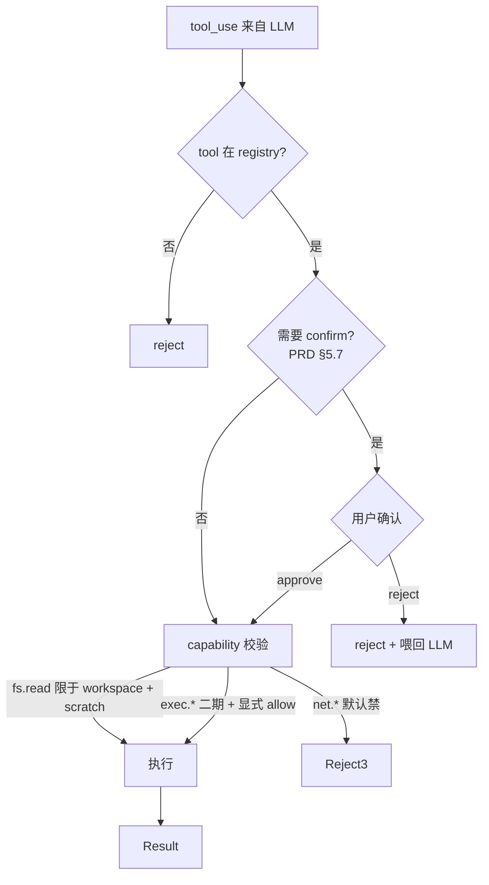
```mermaid
graph TB
  Tool[tool_use 来自 LLM] --> Lookup{tool 在 registry?}
  Lookup -->|否| Reject1[reject]
  Lookup -->|是| Confirm{需要 confirm?<br/>PRD §5.7}
  Confirm -->|是| User{用户确认}
  Confirm -->|否| Cap
  User -->|approve| Cap[capability 校验]
  User -->|reject| Reject2[reject + 喂回 LLM]
  Cap -->|fs.read 限于 workspace + scratch| Run[执行]
  Cap -->|net.* 默认禁| Reject3
  Cap -->|exec.* 二期 + 显式 allow| Run
  Run --> Result
```

**Capability** 定义在 tool 注册元数据里，工具自己声明 + 用户配置 allow/deny。Facade 在调度前对照。

**路径沙箱**（详 §5.5）：fs.read/write 调用前对路径做 `realpath` + `startsWith(workspace_root || scratch_dir)` 校验，拒绝 symlink 越界 + path traversal。

### 5.5 路径访问 — Workspace + Scratch 二域

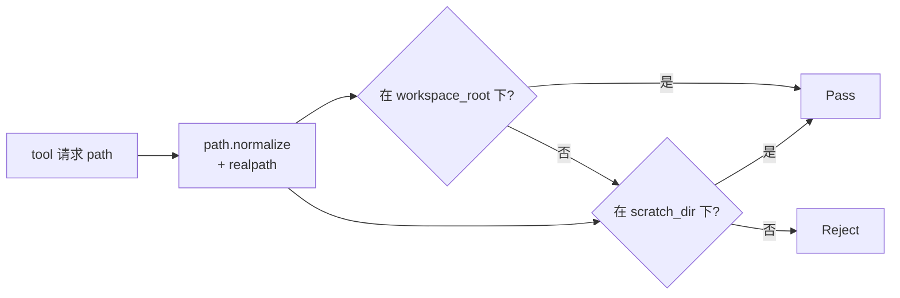
```mermaid
graph LR
  Tool[tool 请求 path] --> Norm[path.normalize<br/>+ realpath]
  Norm --> WS{在 workspace_root 下?}
  Norm --> SC{在 scratch_dir 下?}
  WS -->|是| Pass
  SC -->|是| Pass
  WS -->|否| SC
  SC -->|否| Reject
```

**绝对禁用**：
- symlink 跳出（realpath 后再校验）
- `..` traversal（normalize 后再校验）
- 盘符跳跃（Windows `C:` → `D:`，逻辑校验）
- 句柄继承（不允许 tool 把 fd 传给子进程）

**Workspace 锁定**：会话 turn 进行中工作区路径不可变（PRD §4.22）。fork 才能换。

### 5.6 内容安全 — HTML / Markdown 预览

| 预览类型 | 安全机制 | 拒绝 |
|---|---|---|
| Markdown | markdown-it 渲染 → DOMPurify 清洗 → 注入；代码块用 highlight.js（沙箱内）| `<script>` `on*=` `javascript:` URI |
| HTML | `<iframe sandbox="allow-same-origin">` **不开** allow-scripts；srcdoc 注入 | 任何 JS 执行 |
| 其他二进制 | 不预览，binary fallback provider 显示元信息 | — |
| 文本 | 纯 `<pre>` 渲染，CSS `white-space: pre-wrap` | — |

**Preview Provider 强制约束**（PRD §5.13.1 + 本架构）：

- 禁止 `innerHTML = userContent`（lint 规则）
- 禁止 `eval` / `new Function` / `setTimeout(string)`
- 第三方 provider 必须声明 `dangerous: true`，UI 给红角标 + 二次确认才加载

### 5.7 审计与不可篡改

参 §3.6 Event Sourcing。安全侧补充：

- `audit-YYYY-MM.jsonl` 单文件 append-only，**Rust 写**（Renderer 不直写）。
- 每条记录 `prev_hash = sha256(prev_line)`。第一条 `prev_hash = sha256("")`。
- 启动时校验最后 N=100 条 hash chain，发现不一致 → log warn + 提示用户。
- 文件 mode `0600`（Unix）/ ACL only-user（Windows）。
- 不存敏感字段（参 §3.6）。

### 5.8 Fail-Closed vs Fail-Open 原则

| 子系统 | 失败时行为 | 理由 |
|---|---|---|
| Egress 闸门 / PII 脱敏 / 配额 | **Fail-Closed**（拒绝出域）| 安全敏感 |
| Audit 写入 | **Fail-Closed**（拒绝 invoke）| 无审计不允许操作 |
| Keyring | **Fail-Closed**（拒绝 invoke）| 无 key 无法调用 |
| Tool capability 校验 | **Fail-Closed** | 默认拒绝未声明能力 |
| Markdown 渲染 | **Fail-Open**（fallback 到 text）| 显示性，不影响主流程 |
| Notification Inbox emit | **Fail-Open**（log + 跳过）| 显示性 |
| Compaction summarize | **Fail-Open**（fallback drop_oldest）| 用户体验优先 |
| Trigger 桌宠动作 emit | **Fail-Open**（log + 跳过）| 显示性 |
| Cost 估算（结算阶段）| **Fail-Open**（按 max_tokens 保守计）| 不阻塞 invoke |

**心法**：动到外网、文件系统、凭证、审计 → Closed；只动 UI → Open。

---

## 6. UI 设计系统 — 更美观

PRD §5 给的是布局和具体面板，本节给 **设计系统**：design tokens、组件分层、动效、主题、节奏。**目标**：把 PRD §5 的所有面板用统一语言重新审视一次。

### 6.1 设计原则

| 原则 | 含义 | 反例 |
|---|---|---|
| **Calm**（克制） | 桌宠级，绝不抢夺主屏注意力 | 红色徽章满天飞、动效大跳 |
| **Focused**（聚焦） | 当前对话/操作 96% 视觉权重，外周 ≤ 4% | 侧边栏喧宾夺主 |
| **No-Bling**（不炫技） | 不要无意义渐变 / 玻璃拟态 / 浮雕 | 大量 box-shadow 和 backdrop-filter |
| **Latency-Honest**（延迟诚实） | UI 状态严格反映系统状态，不"假装"加载 | 假进度条 |
| **Reversible**（可撤销） | 危险操作必有 undo / confirm | 一键删除会话无提示 |

### 6.2 Design Tokens

不直接用魔法字面量，全部走 token：

```css
/* tokens/color.css */
:root {
  /* 中性 */
  --color-bg-0: #fafafa;     /* canvas */
  --color-bg-1: #f4f4f5;     /* surface */
  --color-bg-2: #e4e4e7;     /* elevated */
  --color-fg-0: #18181b;     /* primary text */
  --color-fg-1: #52525b;     /* secondary */
  --color-fg-2: #a1a1aa;     /* tertiary / hint */
  --color-border: #e4e4e7;

  /* 强调 — 桌宠主色（与 Live2D 暖调统一） */
  --color-accent: #f59e0b;   /* amber-500 */
  --color-accent-fg: #ffffff;
  --color-accent-soft: #fef3c7;

  /* 状态 */
  --color-success: #10b981;
  --color-warning: #f59e0b;
  --color-danger: #ef4444;
  --color-info: #3b82f6;

  /* LLM 状态专色（与 trigger_key 一致） */
  --color-thinking: #8b5cf6;   /* 紫 */
  --color-streaming: #10b981;  /* 绿 */
  --color-tool: #3b82f6;       /* 蓝 */
  --color-compact: #f59e0b;    /* 琥珀 */
}

[data-theme="dark"] {
  --color-bg-0: #18181b;
  --color-bg-1: #27272a;
  --color-bg-2: #3f3f46;
  --color-fg-0: #fafafa;
  --color-fg-1: #d4d4d8;
  --color-fg-2: #71717a;
  --color-border: #3f3f46;
  --color-accent-soft: #422006;
}

/* tokens/space.css — 8 点栅格 */
:root {
  --space-1: 4px;
  --space-2: 8px;
  --space-3: 12px;
  --space-4: 16px;
  --space-5: 24px;
  --space-6: 32px;
  --space-7: 48px;
  --space-8: 64px;
}

/* tokens/type.css — Mac/Win 系统字体优先 */
:root {
  --font-sans: -apple-system, BlinkMacSystemFont, "Segoe UI Variable",
               "PingFang SC", "Microsoft YaHei", sans-serif;
  --font-mono: "JetBrains Mono", "SF Mono", Consolas, monospace;

  --text-xs: 11px;   /* 12px 字号在 1080p 下 hairline 不够，11 更脆 */
  --text-sm: 13px;
  --text-md: 14px;
  --text-lg: 16px;
  --text-xl: 20px;

  --leading-tight: 1.4;
  --leading-normal: 1.6;
}

/* tokens/radius + shadow.css */
:root {
  --radius-sm: 4px;
  --radius-md: 6px;
  --radius-lg: 10px;
  --radius-full: 9999px;

  --shadow-1: 0 1px 2px rgba(0,0,0,.05);
  --shadow-2: 0 4px 12px rgba(0,0,0,.08);
  --shadow-3: 0 12px 32px rgba(0,0,0,.12);
}

/* tokens/motion.css */
:root {
  --ease-out: cubic-bezier(.2, .8, .2, 1);
  --ease-in-out: cubic-bezier(.4, 0, .2, 1);
  --dur-fast: 120ms;
  --dur-base: 200ms;
  --dur-slow: 300ms;
}
```

**规则**：任何组件 CSS 都只允许引用 token，PR 含 hardcoded 颜色/间距 → 打回。

### 6.3 组件分层

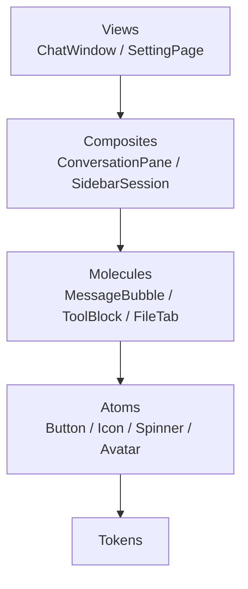
```mermaid
graph TB
  V[Views<br/>ChatWindow / SettingPage] --> C[Composites<br/>ConversationPane / SidebarSession]
  C --> M[Molecules<br/>MessageBubble / ToolBlock / FileTab]
  M --> A[Atoms<br/>Button / Icon / Spinner / Avatar]
  A --> T[Tokens]
```

| 层 | 例子 | 数量 |
|---|---|---|
| Atoms | Button / IconButton / Icon / Avatar / Spinner / Tag / Tooltip / Toast | ~15 |
| Molecules | MessageBubble / ToolBlock / ThinkingBlock / FileTab / SessionItem / WorkspaceChip / HotkeyBadge | ~12 |
| Composites | ConversationPane / SidebarSession / PreviewPane / InputComposer | ~6 |
| Views | ChatWindow / SettingPage(LLM/MCP/Persona/Usage) | ~5 |

### 6.4 主题与桌宠协同

```mermaid
graph LR
  Theme[Theme Token] --> Pet[Live2D 滤镜参数]
  Theme --> ChatUI[Chat 窗口 CSS]
  Theme --> Menu[悬浮菜单]
  System[OS prefers-color-scheme] -.-> Theme
```

- **Auto / Light / Dark** 三档，默认 Auto。
- 暗色模式下 Live2D 模型在 PixiJS layer 加 0.92 亮度 / 1.05 饱和滤镜（与 Chat UI 一致），不切模型。
- 高对比度模式（Win HighContrast 检测）→ 加载 `tokens/contrast.css` override。

### 6.5 信息密度与节奏 — Chat 窗口三栏的视觉权重

```mermaid
graph LR
  L[左栏 240px<br/>会话列表]
  M[中栏 弹性<br/>对话+输入]
  R[右栏 240-800px<br/>预览]
  L -.4%权重.-> M
  M -.80% 权重.-> M
  R -.16% 权重.-> M
```

- **左栏**：仅 13px 字号、no avatar、单行省略、最后一条预览灰色 11px。颜色仅 accent 用于当前选中。
- **中栏**：消息气泡，user/assistant 用 `bg-1 / bg-0`（极浅对比，不用强色块）；thinking/tool 折叠块用 `bg-2`，icon 配 `color-thinking/tool`。
- **右栏**：tab bar 高度 32px，tab 文本 13px；预览内容字号 = Chat 字号 + 1（强调"被预览物"地位）。

### 6.6 状态可视化 — Thinking/Tool/Compacting 的呼吸节拍

| 状态 | 视觉 | 桌宠侧 |
|---|---|---|
| Thinking | 紫色脉动点 (1.2s 周期、scale .8→1.0)，文字"思考中..." | thinking 表情 |
| Streaming | 流式 token 渐入（300ms 内透明度 0→1），cursor 闪烁 | speaking 动作 |
| Tool Running | 蓝色齿轮图标 1s 转一圈（不连续旋转，避免过度 CPU）| working 动作 |
| Compacting | 琥珀色折叠动画，文字"正在整理上下文..." | thinking + light bulb |
| Awaiting Confirm | 弹层模态 + Pet 抖动一次后等待 | look-up + 询问 |
| Error | 红色三角 + 错误码 + 重试按钮 | sad 短动作 1 次 |

**节拍规则**：所有动画 ≤ 300ms；脉动周期 ≥ 1s（避免视觉疲劳）；同时不超过 2 处动画。

### 6.7 动效语言

```css
.fade-in { animation: fade .2s var(--ease-out) both; }
.slide-up { animation: slideUp .2s var(--ease-out) both; }
.pulse { animation: pulse 1.2s var(--ease-in-out) infinite; }

@media (prefers-reduced-motion: reduce) {
  *, *::before, *::after {
    animation-duration: .01ms !important;
    transition-duration: .01ms !important;
  }
}
```

**reduced-motion 必须支持**。系统级开启后所有动效消失，但状态信息（颜色/文字）仍保留。

### 6.8 无障碍 (A11y)

| 维度 | 要求 |
|---|---|
| 键盘 | Tab 顺序合理；Esc 关弹层；Cmd/Ctrl+Enter 发送；↑↓ 切会话 |
| 焦点 | focus-visible ring `2px solid var(--color-accent)`，2px offset |
| 屏幕阅读器 | 所有 IconButton 有 aria-label；ThinkingBlock 有 `role="status"` |
| 对比度 | 文本对比度 ≥ 4.5:1（AA）；UI 控件 ≥ 3:1 |
| 文本缩放 | rem-based；用户系统字号 100%-150% 不破坏布局 |

### 6.9 与 PRD §5 各面板的映射检查表

| PRD 面板 | 设计系统应用 |
|---|---|
| §5.1 Tab | Atom Button + Tag |
| §5.2 槽位卡片 | Composite SlotCard 由 Header / Status / Body / Tools 区组合 |
| §5.4 多模态输入 | Molecule InputComposer + AttachmentChip |
| §5.7 工具确认弹框 | Atom Modal + Composite ToolConfirmDialog |
| §5.9 Inbox | Composite NotificationDrawer + Molecule NotificationItem |
| §5.12 用量仪表盘 | Composite UsageCard × N + Atom Chart (无需引第三方，自绘 SVG sparkline) |
| §5.13 Chat 三栏 | 6.5 节即此面板的视觉权重规则 |
| §5.15 Workspace chip | Molecule WorkspaceChip（已在 6.3 列出）|

---

## 7. 扩展架构 — 强扩展性接入

### 7.1 三类扩展点总览

```mermaid
graph TB
  Ext[扩展点] --> P[Provider Plugin<br/>LLM 厂商]
  Ext --> T[Tool / MCP<br/>能力扩展]
  Ext --> V[Preview Provider<br/>文件预览]
  P -.->|registry| PR[ProviderPluginRegistry]
  T -.->|registry + JSON-RPC| TR[ToolRegistry + MCP Manager]
  V -.->|registry| VR[PreviewProviderRegistry]
```

**统一约束**（适用三类）：

| 约束 | Provider | Tool/MCP | Preview |
|---|---|---|---|
| 显式 id + 版本 | ✅ | ✅ | ✅ |
| Capability 声明 | streaming / thinking / tool_use / vision | params / dangerous / network / fs | mime / ext / sizeBytes |
| 沙箱 | bulkhead + circuit breaker | confirm + capability gate | DOMPurify / iframe-no-script |
| 失败隔离 | open circuit 不影响其他 provider | crash 标 unavailable | throw → binary fallback |
| 加载机制 | 编译期静态注册 + 动态 register | TOML 配置 + 启动加载 | 编译期 + 懒 chunk |
| 版本协商 | manifest.schema_version | MCP `initialize` 协议版本 | schema_version 字段 |

### 7.2 Provider Plugin

**对应 PRD**：§4.15 (Provider Plugin Registry)。

#### 7.2.1 Provider 接口

```ts
export interface LLMProvider {
  readonly id: string;            // 'anthropic' / 'openai' / 'azure-openai' / ...
  readonly displayName: string;
  readonly schemaVersion: '1';
  readonly capabilities: {
    streaming: boolean;
    thinking: boolean;
    tool_use: boolean;
    vision: boolean;
    json_mode: boolean;
    max_context: number;          // 估算用
  };

  /** 探测：用极小请求验证 key/网络可用 */
  ping(cfg: LLMConfig, abort?: AbortSignal): Promise<{ok: true} | {ok: false; reason: string}>;

  /** 主入口：统一 req → 流式 UnifiedDelta */
  invoke(
    cfg: LLMConfig,
    req: UnifiedRequest,
    ctx: ProviderCallContext  // 含 abort / idempotencyKey / onUsage / onChunk
  ): AsyncIterable<UnifiedDelta>;

  /** 估算：用于配额预扣（max_tokens × $/M tokens）*/
  estimateCost(req: UnifiedRequest, cfg: LLMConfig): { input_usd: number; output_usd_max: number };
}
```

#### 7.2.2 注册与查找

```ts
// 启动时
providerPluginRegistry.register(anthropicProvider);
providerPluginRegistry.register(openaiProvider);
// 第三方
providerPluginRegistry.register(myCustomProvider);

// 使用
const provider = providerPluginRegistry.resolve(cfg.provider);
if (!provider) throw new ProviderNotFoundError(cfg.provider);
```

#### 7.2.3 第三方接入步骤

```mermaid
graph LR
  S1[实现 LLMProvider] --> S2[在 app 启动钩子注册]
  S2 --> S3[设置页可选此 provider]
  S3 --> S4[Egress 策略增加该 provider 的允许 data class]
  S4 --> S5[配额/Bulkhead 配置]
  S5 --> Ready[可用]
```

**当前不做插件市场 / 热加载**：所有 Provider 编译期进 bundle。第三方接入 = fork + 加文件。理由：避免动态 import + 任意 JS 执行的安全坑。Phase 2 可考虑沙箱化插件 host（Workers 隔离）。

### 7.3 Tool / MCP

**对应 PRD**：§4.7 Base Tools、§4.8 MCP。

#### 7.3.1 统一 Tool 抽象

```ts
export interface Tool {
  readonly id: string;
  readonly name: string;
  readonly description: string;
  readonly source: 'base' | 'mcp:<server_id>';
  readonly schema: JSONSchema;            // input 形状
  readonly capabilities: {
    fs_read?: boolean;
    fs_write?: boolean;
    network?: boolean;
    exec?: boolean;
    dangerous: boolean;                   // → 强制 confirm
  };
  readonly defaultTimeoutMs: number;

  run(args: unknown, ctx: ToolRunContext): Promise<ToolResult>;
}

interface ToolRunContext {
  workspace_root?: string;
  scratch_dir: string;
  session_id: string;
  turn_id: string;
  abort: AbortSignal;
  log: (msg: string) => void;
}
```

#### 7.3.2 MCP Server 接入

```mermaid
sequenceDiagram
  participant U as User
  participant CFG as config.toml
  participant Mgr as MCP Manager (Rust)
  participant SRV as MCP Server (child)

  U->>CFG: 配置 mcp.fs.command = "..."
  Note over CFG: 启动时
  Mgr->>SRV: spawn (stdio / HTTP)
  Mgr->>SRV: initialize {protocolVersion: '2024-11-05'}
  SRV-->>Mgr: capabilities + tools
  Mgr->>Mgr: 注册到 ToolRegistry id='mcp:fs:read_file' ...
  
  Note over U,SRV: invoke 期间
  Mgr->>SRV: tools/call {name, args}
  SRV-->>Mgr: result / error
  Mgr-->>Facade: ToolResult
```

**进程模型**：每个 MCP server 一个 child 进程（stdin/stdout JSON-RPC）。stderr 收集到日志，崩溃 → 标 `unavailable`，下次工具调用前 lazy 重启（一次）。

**安全隔离**：
- MCP child 不继承父进程文件描述符（设 `close-on-exec`）。
- 路径限制由 Facade 在调用前校验（不信任 MCP 自己说"我会守规矩"）。
- 超时统一在 Facade 侧，MCP 卡住不会拖死 Harness。

### 7.4 Preview Provider

**对应 PRD**：§5.13.1（已详）。本节给 **跨扩展点的统一视角**：

```ts
export interface PreviewProvider {
  readonly id: string;
  readonly displayName: string;
  readonly priority: number;
  canRender(input: PreviewInput): boolean;
  component: () => Promise<{ default: Component }>;
}
```

**调度**：dispatch 选 `priority desc` + `canRender = true` 第一个。Throw → fallback 到 `binary`。

**与其他扩展点共性**：
- 同构 Registry。
- 失败隔离（自己崩，不连累整个 Preview Pane）。
- 显式 capability（`canRender` 即 capability 声明）。
- 编译期注册，无热加载。

### 7.5 扩展点反模式 — 不要这么做

| 反模式 | 为什么不行 |
|---|---|
| 把 trigger_key 也搞成可注册扩展点 | trigger_key 是 contract（PRD §4.10），需要 Pet 端配合，开放注册 → 表情资源缺失 → 体验崩 |
| Persona 改成插件 | Persona 是数据 + 系统 prompt，不是行为；用配置文件即可 |
| 给 Egress 策略开第三方钩子 | 安全敏感，外部代码不能决定数据出域 |
| 给 PII 脱敏开第三方钩子 | 同上 |
| Audit 写入路径开放给插件 | 不可篡改是审计的灵魂 |

**心法**：只对 **可替换的输入/输出** 开扩展点；对 **安全/审计/合约** 收缩。

### 7.6 版本协商

| 扩展点 | 版本字段 | 不兼容时 |
|---|---|---|
| Provider Plugin | `schemaVersion: '1'` | register 拒绝 + 启动 warn |
| MCP Server | `protocolVersion` (MCP 标准) | initialize 失败 → 标 unavailable + warn |
| Preview Provider | `schemaVersion: '1'` | register 拒绝 + 启动 warn |
| Tool 内部 schema | JSON Schema, 不显式版本（由 capability 描述形状）| 调用前用 schema 校验 args，不通过 → 喂回 LLM |

---

## 8. ADR 速查

每条 ADR 三句话：决定 / 理由 / 取舍。详细背景在 PRD 中。

| # | 决定 | 理由 | 取舍 |
|---|---|---|---|
| ADR-001 | **不集成 Claude Code CLI / Agent SDK**，自建 Harness | 多 Provider / 不锁定 / 可控 egress / 不引 Node 运行时 | 初期开发量大 ~3-4 倍；不能"白嫖"上游优化 |
| ADR-002 | **MCP 单层全局**，工作区不携带 MCP 配置 | UI 不爆炸；配置心智成本可控；安全审计简单 | 失去 per-workspace 隔离 |
| ADR-003 | **配置入 TOML 而非 SQLite** | 人可读 / git 友好 / 启动快 / 无 db 迁移负担 | 大量配置时性能差（不预期出现） |
| ADR-004 | **Workspace 中途不可改，只 fork** | 同会话内路径白名单一致，避免历史消息引用失效 | 用户切目录略麻烦 |
| ADR-005 | **Preview Registry 优先级数字化** + 同优先级先注册先获胜 | 行为可预测，不依赖声明顺序 | 第三方需要"挤进高优先级"时不优雅 |
| ADR-006 | **Provider HTTPS 走 Rust 端而非 Renderer** | 明文 API key 永不出 Rust 进程 | 多一次 IPC、流式 emit_to 复杂度增加 |
| ADR-007 | **per-session scratch sandbox**（100MB 上限） | 解决"无工作区时文件出不来"问题，又不让 LLM 漫游全盘 | 用户可能不理解为什么文件去了 scratch |
| ADR-008 | **审计日志 append-only + hash chain，Rust 写** | 不可篡改性；防止 Renderer 漏洞污染审计 | crash 在写中间会留半行（启动校验时跳过损坏行）|
| ADR-009 | **Bulkhead per-provider + Circuit Breaker per-provider** | 一家挂不影响另一家；429 不计入 CB | 配置变量增多 |
| ADR-010 | **Fail-Closed for Audit / Keyring / Egress / Quota** | 安全优先 | 偶发故障时整体不可用 |
| ADR-011 | **编译期注册扩展点，不做热加载** | 安全 / 启动可预测 / 无任意 JS 执行 | 第三方接入 = fork |
| ADR-012 | **统一 Trigger Key 8 个**（含 `llm.compacting`） | 桌宠表情/动作可控集合 | 新增 trigger 需要 Pet 资源配合 |
| ADR-013 | **Markdown 渲染 markdown-it + DOMPurify，HTML 用 iframe-no-script** | XSS 防御深度纵深 | 不能展示动态 HTML（设计取舍）|
| ADR-014 | **不引第三方图表库**，自绘 SVG sparkline | bundle 体积；无 license 风险；克制美学 | 用量仪表盘交互弱 |
| ADR-015 | **设计 token 全 CSS 变量，不上 CSS-in-JS** | 主题切换零运行时开销；devtools 改样式直观 | 不能在 token 计算里写 JS 表达式 |

---

## 9. 落地路径

### 9.1 与 PRD §10 Milestones 的映射

```mermaid
gantt
  title LLM 子系统 落地节奏（架构视角）
  dateFormat YYYY-MM-DD
  section 基础
  M1 Harness 骨架 + 单 Provider :m1, 2026-07-01, 14d
  M2 多 Provider + Registry :m2, after m1, 7d
  M3 Tool / Base Tools :m3, after m2, 7d
  M4 MCP 接入 :m4, after m3, 10d
  section 流程
  M5 Stream 归一 + 错误模型 :m5, after m2, 7d
  M6 Persona / Context 注入 :m6, after m5, 5d
  M7 Memory / Knowledge :m7, after m6, 10d
  section 安全
  M8 Egress / PII / Quota :m8, after m4, 10d
  M9 Audit / Keyring :m9, after m8, 7d
  section UI
  M10 设置面板 :m10, after m6, 10d
  M11 用量仪表盘 :m11, after m9, 5d
  M12 Chat 窗口 + Session/Workspace + 热键 :m12, after m10, 14d
```

### 9.2 架构验证检查表（每个 milestone 必过）

| 维度 | 检查 |
|---|---|
| 分层 | ESLint `no-restricted-imports` 通过；Adapter 不知道 role 概念 |
| 模式 | Registry / Strategy / Saga 三处至少有一处单测覆盖 |
| 可用性 | 故障注入 §4.8 至少 5 项通过 |
| 安全 | Egress / PII / Quota 三闸门必经；secret 不出 Rust 经 grep + DAST |
| 美学 | 视觉对照表（6.5）评审通过；reduced-motion 测试通过 |
| 扩展 | 新增一个 Mock Provider / Mock Tool / Mock Preview 各 ≤ 50 行通过 |
| 文档 | 新决策若与 ADR 冲突 → 新增 ADR-N，本文更新 |

### 9.3 何时该回头改本文

- 决定新增 / 取消一个 Provider 抽象的字段
- 决定改变 Z0-Z4 信任域边界
- 决定改变 fail-closed / fail-open 默认
- 决定改变三个 Registry 的统一约束
- 新增 ADR

**不需要改本文**的情况：增加一个具体 Provider / Tool / Preview / Persona / Knowledge Source —— 那是配置 + 实现，不是架构。

---

## 10. 附录

### 10.1 词汇表

| 术语 | 定义 |
|---|---|
| **Role / 槽位** | 业务身份（chat_assistant / message_processor），调用方对外只用 role |
| **Provider** | LLM 厂商协议适配（Anthropic / OpenAI / Gateway）|
| **Harness** | 包裹 Provider 调用的所有横切关注（Turn loop / 流归一 / 重试 / 审计 / 配额）|
| **Turn** | 一轮对话，可能内部多次 Provider 往返 + 工具调用 |
| **Facade** | Harness 对业务的唯一入口 `llm.invoke(role, req)` |
| **Workspace** | 当前会话绑定的文件目录根 |
| **Scratch** | 每会话独有的临时沙箱 `~/.core-ai-pet/scratch/<session_id>/` |
| **Trigger Key** | 桌宠表情/动作的语义键（PRD §4.10，8 个）|
| **Egress** | 数据出本机域到外网 Provider |
| **Bulkhead** | 隔舱模式 — 资源池分区，故障不外溢 |
| **Saga** | 长事务编排 — 有补偿动作的有状态流程 |
| **Idempotency-Key** | 重试同一请求的去重标识 |
| **MCP** | Model Context Protocol，工具/资源协议标准 |

### 10.2 PRD 锚点反向索引

| 本文章节 | 引用 PRD |
|---|---|
| §1.2 信任域 | §1.3 威胁模型 |
| §1.3 桌宠协同 | §4.10 Pet 动作 |
| §2.1 容器图 | §6 后端 / §7 项目结构 |
| §3.1 分层 | §4.1 分层与依赖方向 |
| §3.2 六边形 | §4.2 核心抽象 |
| §3.3 Registry × 3 | §4.2 LLMRegistry / §4.15 ProviderPluginRegistry / §5.13.1 PreviewProviderRegistry |
| §3.4 Strategy 压缩 | §4.21 Context 管理 |
| §3.5 Saga / Turn | §4.6 Turn 语义 / §4.10 Trigger 一致 |
| §3.6 Event Sourcing | §6.6 审计日志 |
| §3.7 Bulkhead | §4.15 + §4.19 |
| §4.2 状态超时 | §4.6 / §4.10 |
| §4.3 流式归一 | §4.4 |
| §4.5 限流配额 | §4.19 |
| §5.2 Egress 三层 | §4.17 / §4.18 / §4.19 |
| §5.4 工具沙箱 | §4.7 / §4.8 / §5.7 |
| §5.5 路径沙箱 | §4.22 / §4.11 |
| §5.6 内容安全 | §5.13 / §5.13.1 |
| §5.7 审计 | §6.6 |
| §6 设计系统 | §5 全章 |
| §7.2 Provider Plugin | §4.15 |
| §7.3 Tool / MCP | §4.7 / §4.8 |
| §7.4 Preview | §5.13.1 |
| §9.1 Milestones | §10 |

### 10.3 Mermaid 源图索引

| 图 | 位置 | 用途 |
|---|---|---|
| 五大质量映射 | §0.2 | 阅读导航 |
| System Context | §1.1 | C4 L1 |
| 桌宠协同 | §1.3 | 子系统边界 |
| 容器图 | §2.1 | C4 L2 |
| 分层 | §3.1 | 主骨架 |
| 六边形 | §3.2 | 端口适配 |
| Strategy 压缩 | §3.4 | 三策略分支 |
| Turn 状态机 | §3.5 | Saga 全景 |
| Bulkhead | §3.7 | 资源池 |
| Harness 全图 | §4.1 | SDK vs Harness |
| Stream Pipeline | §4.3 | 归一化 |
| Circuit Breaker | §4.4.2 | 故障熔断 |
| Egress 闸门 | §1.2 / §5.2 | 安全三层 |
| 凭证生命周期 | §5.3 | 时序图 |
| 工具沙箱 | §5.4 | 调度判定 |
| 路径校验 | §5.5 | fs 沙箱 |
| 主题协同 | §6.4 | 主题分发 |
| 三栏权重 | §6.5 | 视觉密度 |
| 扩展点总览 | §7.1 | 三类扩展 |
| MCP 接入 | §7.3.2 | 时序 |
| Milestones | §9.1 | 甘特 |

---

## 修订记录

| 版本 | 日期 | 说明 |
|---|---|---|
| 1.0 | 2026-06-27 | 初版。对齐 PRD-LLM-Integration.md v1.5。10 章 / ~1500 行 / Mermaid。 |
